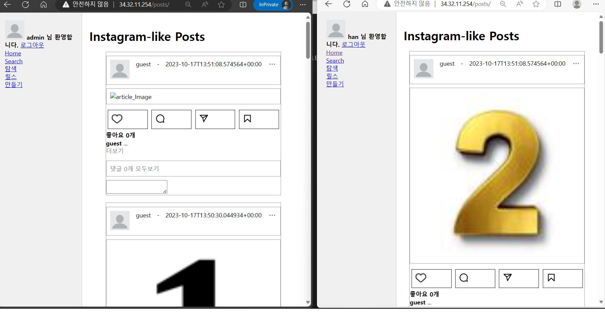

# django_clustering
이번 글에서는
apache, django, mariaDB, google cloud storage를 이용하여 WAS(django)를 다중화 해보자.

이전의 프로젝트에서 우리는 아파치-장고-마리아db로 서버를 구축했다.

*https://github.com/hanhunh89/insta_clone

먼저 한개의 서버에 아파치, 장고, 마리아디비를 한번에 구축했다.

그 다음 사용자가 늘어나면서 web-was-db 를 세개의 서버로 분리했다.

이제 또다시 서비스가 늘고있다. 

django를 다중화해보자

이번 글을 통해서 다음 세가지를 알 수 있다. 
1. apache로 django 다중화
2. 다중화된 django의 session clustering
3. 다중화된 django 서비스를 위한 google cloud storage 구성.

------------------
시작해보자
## WAS서버 구성
### 1. 새로운 django 서버 구성 및 django settings.py 파일에서 mysql 접속 설정

   *https://github.com/hanhunh89/insta_clone 을 참고하여 django를 하나 더 구성한다.

  setting.py파일을 아래와 같이 수정한다. 
  SQLlite 내용을 주석처리하고 mysql 내용을 적용한다. 
  ```
  '''
  #setting for SQLlite
  DATABASES = {
    'default': {
      'ENGINE': 'django.db.backends.sqlite3',
      'NAME': BASE_DIR / 'db.sqlite3',
    }
  }
  #setting for mysql
  '''
  DATABASES = {
    'default': {
        'ENGINE': 'django.db.backends.mysql',
        'NAME': 'mydatabase',
        'USER': 'myuser',
        'PASSWORD': '12341234',
        'HOST': '34.64.146.23',
        'PORT': '3306',
     }
  }
  ```

### 2. gunicorn 구동
  *https://github.com/hanhunh89/insta_clone 을 참고하여 gunicorn 구동
  ```
  gunicorn --bind 0:8000 myproject.wsgi:application 
  ```

## DB서버 구성
### 1. DB에 새로운 WAS가 접속할 수 있도록 구성한다. 
  db에 접속 후 다음의 쿼리로 db에 접속 가능한 django 서버 ip를 확인한다.
  ```
  mariaDB [myDB]> SELECT user, host FROM mysql.user WHERE user = 'myuser'
  ```
  이전에 insta_clone에서 구성한 한개의 서버만 보일것이다.
  다음의 명령어로 새로 만든 django 서버도 추가해준다.
  ```
  GRANT ALL PRIVILEGES ON myDB.* TO 'myuser'@'34.125.160.132' IDENTIFIED BY 'password123123' WITH GRANT OPTION;
  FLUSH PRIVILEGES;
  ```
  이제 다시 db에 접속가능한 django 서버 ip를 확인하면 두개의 ip가 뜰 것이다.
  ```
  mariaDB [myDB]> SELECT user, host FROM mysql.user WHERE user = 'myuser'
  ```


## WEB 서버 구성 
### 1. 아파치 서버 설정

   virtualhost를 수정합니다.

   *아파치 공식문서를 참고했습니다.
   
   *https://httpd.apache.org/docs/2.4/mod/mod_proxy_balancer.html
   ```
   cd /etc/apache2/conf-available
   ```
   cluster.conf 파일을 만들고 아래와 같이 입력합니다.
   ```
   <VirtualHost *:80>
     ServerName 34.64.106.7
     #ProxyPass / http://34.64.44.173:8000/
     #ProxyPassReverse / http://34.64.44.173:8000/

     ProxyPass / balancer://mycluster/
     ProxyPassReverse / balancer://mycluster/
     Header add Set-Cookie "ROUTEID=.%{BALANCER_WORKER_ROUTE}e; path=/" env=BALANCER_ROUTE_CHANGED
     <Proxy balancer://mycluster>
       BalancerMember http://34.64.44.173:8000 route=1
       #34.64.44.173 -> django 1번서버 ip
       BalancerMember http://34.125.160.132:8000 route=2
       #34.125.160.132 -> django 2번서버 ip
       ProxySet stickysession=ROUTEID
     </Proxy>  
        
     ErrorLog ${APACHE_LOG_DIR}/error.log
     CustomLog ${APACHE_LOG_DIR}/access.log combined
   </VirtualHost>
   ```

### 2. 이제 virtualhost가 충돌하지 않게 정리합니다.
   ```
   cd /etc/apache2/sites-enabled
   ls
   ```
   ls의 결과를 보면 아래의 두개 파일이 보입니다.
   ```
   aaa@apache:/etc/apache2/sites-enabled$ ls
   000-default.conf  my.conf
   ```
   my.conf는 충돌할 우려가 있으므로 해제합니다.
   ```
   sudo a2dissite my.conf
   ```
   다시 ls를 쳐보면 my.conf가 사라졌습니다.

   이제 cluster.conf를 적용합니다.
   ```
   sudo a2ensite cluster.conf
   ```

### 3. 이제 필요한 mod를 enable 해줍니다. 
   ```
   sudo a2enmod proxy
   sudo a2enmod proxy_balancer
   sudo a2enmod lbmethod_byrequests
   sudo a2enmod headers
   sudo a2enmod proxy_http
   ```

### 4. 아파치 서버 재시작
   ```
   sudo service apache2 restart
   ```

## FAIL OVER TEST
   이제 두개의 장고 서버가 클러스터링 되었습니다. 
   하나의 장고서버가 fail되면 자연스럽게 나머지 하나의 서버로 접속합니다.

------------------------------------------------

하지만 이 구성에는 두가지의 문제가 있습니다.

1. 이미지를 was 서버에 저장해서, 이중화된 다른 서버에서 참조가 불가능하다.

2. 세션이 하나의 서버에 sticky하게 묶여있다.

먼저 1번부터 해결합시다. 

브라우저 두개로 각각 게시물을 업로드해 봅시다.
1번 서버와 2번 서버의 화면이 다릅니다. 
같은 사이트인데도 보여주는 이미지가 다르다니... 망했습니다. 





이것은 각각의 서버가 이미지를 각자의 서버에 저장하기 때문입니다.

1번 서버에 dog.jpg를 올린다고 합시다.

1번 서버에 dog.jpg가 저장되고 dbserver 에 반영됩니다.

2번 서버로 접속하면 db에서는 "dog.jpg가 있어!" 라고 하지만,

2번 서버에는 dog.jpg파일이 없습니다. 

그래서... 파일을 찾을 수 없는 상태가 됩니다.

우린 망했습니다.

이 프로젝트를 다시 살리기 위해

이미지나 동영상 파일 같은 첨부파일은 별도의 스토리지에 저장합니다.

gcp의 클라우드 스토리를 사용해 봅시다.

# Google Cloud Storage 설정

## 1. Google Cloud Storage 생성
  https://cloud.google.com/?hl=ko 접속
  <console로 이동> - google cloud 옆에 <탐색메뉴> - <cloud storage> - <만들기>
  버킷 이름을 지정하여 생성합니다. 저는 "my_insta_clone" 으로 정했습니다. 

## 2. 사용자 권한설정 수정

이제 내 스토리지에 일반 사용자가 접근 가능하도록 수정합시다. 
<my_insta_clone> - <권한> - <공개 액세스 방지 삭제> - <확인>
동일한 화면에서 <주 구성원 추가> - 새 주 구성원에 <allUsers> 입력 - 역할에 <환경 및 스토리지 객체 뷰어> 입력
<저장> - <공개 액세스 허용>

이제 스토리지에 올린 파일을 누구나 접근할 수 있습니다. 

## 3. django가 접속할 수 있는 권한 설정

이제 django가 cloud storage에 접근하여 파일을 업로드 할 수 있도록 수정합시다.
  https://cloud.google.com/?hl=ko 접속
  <console로 이동> - google cloud 옆에 <탐색메뉴> - <IAM 및 관리자> - <서비스계정> -
  <서비스 계정 만들기> - 서비스 계정 이름에 계정명을 입력합니다. 저는 <django>라 했습니다.이후
  <만들고 계속하기> - 역할선택에 <편집자> 입력 - <완료>

  여기서 django 서버에 입력할 키 파일을 받아야 합니다.
  <서비스 계정> - 생성한 계정 클릭 - <키> - <키 추가> - <새 키 만들기> - <json> - <만들기>
  이후엔 자동으로 키 파일이 다운로드 됩니다. 이 키 파일을 django 서버에 넣을겁니다. 

# django 서버 설정

## 1. django 서버에서 필요한 lib 설치
  ```
  pip install django-storages
  pip install google-cloud
  pip install google-auth
  pip install google-cloud-storage
  ```

## 2. 서버에 키 파일 업로드하기 
  django 서버에 키파일을 업로드하고 위치를 기억합니다.

## 3. django settings.py 수정
  ```
  #setting for Google Cloud Storage
  #python manage.py collectstatic 하면 STATICFILES_DIRS에 있는 파일을 STATIC_ROOT로 모은다.
  #하지만 google cloud storate를 위해 STORAGES={"staticfiles" : ~}를 설정해서 gcloud로 간다.

  #이제 미디어파일과 스태틱파일은 google storage에 저장되기 때문에 아래 설정 불필요
  #STATIC_ROOT = os.path.join(BASE_DIR, 'static')
  #MEDIA_ROOT = os.path.join(BASE_DIR, 'media')

  STATICFILES_DIRS = [ 
    "/home/embdaramzi/my/insta/myenv/myproject/posts/static",
    "/home/embdaramzi/my/insta/myenv/myproject/media",
  ]

  STORAGES = {
    "default": {
      "BACKEND": "storages.backends.gcloud.GoogleCloudStorage",
      "OPTIONS": {
        "project_id": "dogwood-range-400908", #여기에 google cloud project id 입력
        "bucket_name": "insta_clone_storage", #여기에 bucket name 입력
        "location": "my",  # google cloud stroage 에 생성할 디렉토리 이름
      },
    },
    "staticfiles": {
      "BACKEND": "storages.backends.gcloud.GoogleCloudStorage",
      "OPTIONS": {
        "project_id": "dogwood-range-400908",
        "bucket_name": "insta_clone_storage",
        "location": "my",  # django에 생성할 디렉토리 이름
      },
    },
  }

  from google.oauth2 import service_account
  GS_CREDENTIALS = service_account.Credentials.from_service_account_file(
    # 여기에 키파일의 경로를 입력
    "/home/embdaramzi/my/insta/dogwood-range-400908-d7cf1dd03e3b.json"
  )

  ```
## 4. django settings.py 수정
  ```
  cd /home/embdaramzi/my/insta/myenv/myproject/myproject
  nano urls.py
  ```
  ```
  #클라우드 스토리지 설정으로 해당 내용 불필요
  #urlpatterns += static(settings.MEDIA_URL, document_root=settings.MEDIA_ROOT)
  #urlpatterns += static(settings.STATIC_URL, document_root=settings.STATIC_ROOT)
  ```

## 5. static 파일을 google cloud storage로 복사
  django 서버에 있는 static 파일을 복사합시다.
  static 파일은 js, image, css등의 변하지 않는 파일을 의미합니다.

  그 전에 /home/embdaramzi/my/insta/myenv/myproject/static 아래에 있는 내용을
  /home/embdaramzi/my/insta/myenv/myproject/posts/static으로 이동시킵시다.
  static_root와 staticfiles_dirs가 겹치면 안되기 때문입니다.
  ```
  python3 manage.py collectstatic
  ```
  이후 클라우드 스토리지를 확인하면 js파일과 이미지 파일이 복사된 것을 확인할 수 있습니다. 
  
## 6. django 구동
  ```
  gunicorn --bind 0:8000 myproject.wsgi:application
  ```

  이제 홈페이지로 접속하면 정상적인 화면을 볼 수 있습니다. 


# Redis 를 이용한 django session clustering 

이제 슬슬 지칩니다. 하지만 힘을 냅시다. 사실 이대로 서비스해도 큰 문제는 없습니다.
현재의 구성에서는 apache2에서 sticky session을 사용했습니다. 
처음에 django#1로 접속하면 계~~~ 속 django#1로 접속하게 됩니다.
운이 없으면 특정 서버로 트래픽이 몰리게 됩니다. 로드밸런싱 의미가 없습니다.

또한 django#1로 접속했다가, #1이 죽으면 로그인이 끊기게 됩니다.
불편하겠죠.

이제 session 정보를 별도의 서버에 저장합시다. 

별도의 서버는 redis를 이용합니다. 

redis는 메모리에서 돌아가서 겁나 빠르고 key-value 저장을 지원하여
session data를 다루기에 적합합니다. 

aws나 gcp에서 다양한 서비스를 지원하지만 우리는 별도의 서버에 redis를 구축합니다.
redis를 사용할 줄 알면 클라우드 서비스 이용은 어렵지 않기 때문입니다. 

## 1. redis 설치
  ``
  sudo apt-get update
  sudo apt-get install redis
  ```

## 2. django 서버에서 redis 관련 lib 설치
  ```
  pip install django-redis
  sudo apt-get install redis-tools
  python manage.py createcachetable
  ```

## 3. django settings.py 수정
  ```
  CACHES = {
    "default": {
      "BACKEND": "django_redis.cache.RedisCache",
      "LOCATION": "redis://34.64.173.202:6379/1",
        "OPTIONS": {
        "CLIENT_CLASS": "django_redis.client.DefaultClient",
      }
    }
  }

  SESSION_ENGINE = "django.contrib.sessions.backends.cache"
  SESSION_CACHE_ALIAS = "default"
  ```
## 3. redis debug를 위해 log level 변경
  로그레벨은 아래 중 하나를 고를 수 있다. 우리는 debug로 바꿀것이다.  그 상태로 redis가 돌아가는 것을 살펴보자.
  또한 외부에서 접속할 수 있게 보안설정을 변경한다. 
  ```
  sudo nano /etc/redis/redis.conf
  #loglevel notice
  loglevel debug
  bind 123.123.123.123 # 여기엔 redis 서버의 ip를 입력함.
  ```
->>> 아파치 설정을 바꿔서 스티키 세션 수정한다.
-> 또한 서버의 소스코드를 바꿔서 서버별로 색깔 다르게 해서 다르게 접속 확
